# 積木依賴圖（影像自動化歸檔中樞系統）

> 本文件內文引用的「ACDS 第 X 章」「AVS 第 X 節」等條號，指的是作者個人使用的
> 治理框架本體，目前尚未一併公開，此處保留是為了如實呈現規則的原始出處，並非
> 遺漏連結。規則本身的內容與理由已直接寫在引用它的句子裡，不影響閱讀理解。

> **依據**：ACDS v2.4 第五章。建立新積木或調整依賴時同步更新，防止隱性相依。
> **建立方式**：與 `ACDS_ContractRegistry.md` 同批逆向建檔，資料來源為
> 各模組 Manifest 之 `IMPORTS` 欄位，並額外對
> **實際程式碼中的 `Call` 陳述式與 `New` 實例化**做交叉比對（見附錄）。
> **建檔基準版本**：`鄭詩樺_影像整理檔_v77.xlsm`（2026-09）。
> 全域腳本掃描（含 `Call X.Y`／`New X`／`Set x = X.Y` 三種呼叫型態）確認：
> **全專案 IMPORTS 宣告與實際呼叫已零落差**，附錄三與附錄四所有項目皆已
> 修正並逐行核實，本文件不再有任何「待套用」或「尚未核實」的殘留提醒。
> **狀態**：Accepted。

---

## 一、分層依賴總覽（依 ACDS 第四章、AVS 第五節）

依 `影像整理檔_V2_規格書.md` 第六部分既有 ASCII 拓樸圖，改繪為 Mermaid，
方向不變：**單向、線性，View → Router → Flow → Action → Rule → Utils**。

```mermaid
graph TD
    subgraph View["View 監聽層"]
        TW[ThisWorkbook]
        UI_SHEET[操作介面 工作表事件]
    end

    subgraph Router["Router 路由層"]
        MAIN[Mod_Main]
    end

    subgraph ActionAdmin["Action 維護層"]
        SYSADMIN[Mod_SystemAdmin]
        UITOGGLE[Mod_UIToggles]
    end

    subgraph Flow["Flow 調度層"]
        PIPELINE[Mod_Pipeline]
        SCANNER[Mod_StateScanner]
        DAG[cls_DAGEngine]
        FACTORY[Mod_CommandFactory]
        ICMD[ICommand 介面合約]
    end

    subgraph Commands["具體 Command"]
        CIMPORT[cmd_Import]
        CRESCUE[cmd_Rescue]
        CDEDUP[cmd_Deduplicate]
        CREBUILD[cmd_Rebuild]
        CPREVIEW[cmd_PreviewLayout]
    end

    subgraph Action["Action 執行層"]
        LAYOUT[Mod_LayoutEngine]
        THUMB[Mod_ThumbnailCache]
        GDIPLUS[Mod_GDIPlusExport]
        UIRESET[Mod_UIReset]
        COLLISION[Mod_ImportCollisionGate]
        ACTIONS[Mod_Actions]
        EXPORT[Mod_Export]
        EMPTYCLEAN[Mod_EmptyFolderCleaner]
        NORMALIZER[Mod_FilenameNormalizer]
        BOOTSTRAP[Mod_Bootstrap]
        FORCEUNLOCK[Mod_ForceUnlock]
    end

    subgraph Messenger["展示組件（唯一彈窗權限）"]
        MSG[Mod_UIMessenger]
    end

    subgraph Rule["Rule 邏輯層"]
        RULES[Mod_Rules]
    end

    subgraph Utils["Utils 工具層 / 底層基礎物件"]
        UTILS[Mod_Utils]
        CONFIG[cls_Config]
        STRLIB[cls_StringLibrary]
        LOG[cls_Log]
        CTX[cls_ExecutionContext]
        UDF[Mod_UDF]
    end

    TW --> MAIN
    UI_SHEET --> MAIN
    UI_SHEET --> CONFIG
    UI_SHEET --> STRLIB
    UI_SHEET --> MSG
    UI_SHEET --> UITOGGLE
    UI_SHEET --> UTILS

    MAIN --> PIPELINE
    MAIN --> SYSADMIN
    MAIN --> EXPORT
    MAIN --> UIRESET
    MAIN --> UITOGGLE
    MAIN --> STRLIB
    MAIN --> CTX
    MAIN --> UTILS
    MAIN --> CONFIG
    MAIN --> LOG

    PIPELINE --> CONFIG
    PIPELINE --> CTX
    PIPELINE --> STRLIB
    PIPELINE --> ACTIONS
    PIPELINE --> RULES
    PIPELINE --> UTILS
    PIPELINE --> MSG
    PIPELINE --> UITOGGLE
    PIPELINE --> DAG
    PIPELINE --> FACTORY
    PIPELINE --> SCANNER

    DAG --> ICMD
    DAG --> CONFIG
    DAG --> LOG
    FACTORY --> ICMD
    FACTORY --> CIMPORT
    FACTORY --> CRESCUE
    FACTORY --> CDEDUP
    FACTORY --> CREBUILD
    FACTORY --> CPREVIEW

    SCANNER --> CTX
    SCANNER --> RULES
    SCANNER --> ACTIONS
    SCANNER --> UTILS

    CIMPORT --> CTX
    CIMPORT --> ACTIONS
    CIMPORT --> RULES
    CIMPORT --> UTILS

    CRESCUE --> CTX
    CRESCUE --> UTILS
    CRESCUE --> GDIPLUS

    CDEDUP --> CTX
    CDEDUP --> RULES
    CDEDUP --> UTILS
    CDEDUP --> ACTIONS
    CDEDUP --> CONFIG
    CDEDUP --> STRLIB

    CREBUILD --> CTX
    CREBUILD --> RULES
    CREBUILD --> ACTIONS
    CREBUILD --> UTILS
    CREBUILD --> LAYOUT
    CREBUILD --> UIRESET
    CREBUILD --> THUMB
    CREBUILD --> EMPTYCLEAN
    CREBUILD --> COLLISION

    CPREVIEW --> CTX
    CPREVIEW --> RULES
    CPREVIEW --> LAYOUT
    CPREVIEW --> CONFIG

    ACTIONS --> CONFIG
    ACTIONS --> UTILS
    ACTIONS --> RULES
    ACTIONS --> GDIPLUS
    ACTIONS --> UIRESET

    LAYOUT --> CTX
    LAYOUT --> UTILS
    LAYOUT --> RULES
    LAYOUT --> CONFIG

    EXPORT --> CTX
    EXPORT --> UTILS
    EXPORT --> MSG
    EXPORT --> ACTIONS
    EXPORT --> RULES
    EXPORT --> STRLIB
    EXPORT --> UIRESET

    UIRESET --> CONFIG
    UIRESET --> STRLIB
    UIRESET --> UTILS
    UIRESET --> MSG
    UIRESET --> UITOGGLE
    UIRESET --> LOG

    UITOGGLE --> CONFIG
    UITOGGLE --> UTILS
    UITOGGLE --> MSG
    UITOGGLE --> STRLIB

    COLLISION --> UTILS
    COLLISION --> MSG
    COLLISION --> ACTIONS

    SYSADMIN --> CTX
    SYSADMIN --> CONFIG
    SYSADMIN --> STRLIB
    SYSADMIN --> UTILS
    SYSADMIN --> MSG
    SYSADMIN --> ACTIONS
    SYSADMIN --> RULES
    SYSADMIN --> UIRESET

    THUMB --> CONFIG
    THUMB --> UTILS
    THUMB --> ACTIONS

    EMPTYCLEAN --> UTILS
    EMPTYCLEAN --> CONFIG
    NORMALIZER --> UTILS
    NORMALIZER --> CONFIG

    BOOTSTRAP --> CONFIG
    BOOTSTRAP --> STRLIB
    BOOTSTRAP --> RULES
    BOOTSTRAP --> ACTIONS
    BOOTSTRAP --> MSG
    BOOTSTRAP --> UTILS
    BOOTSTRAP --> UIRESET

    RULES --> CONFIG
    CTX --> CONFIG
    ICMD --> CTX
    LOG --> CONFIG
    LOG --> STRLIB
```



**孤立節點（純工具／底層基礎物件，刻意零依賴）**：
`Mod_Utils`、`cls_Config`、`cls_StringLibrary`、`Mod_UIMessenger`、`Mod_UDF`、
`Mod_GDIPlusExport`（純 Windows API，見其 FORBIDDEN 條款）、
`Mod_ForceUnlock不公開`。判準：該操作是否要看業務規則才能決定怎麼做（不要，
純技術動作）、換到別的功能是否還會重複出現、有沒有需要生命週期管理的資源——
三問全部符合才歸類為此類底層工具。這些節點沒有 outgoing edge 是正常狀態，
積木架構本就允許孤立存在，不因此降低合規性，非遺漏。

---

## 二、Command Pattern 判準確認（AVS 第五節）

本專案 `cmd_Import`／`cmd_Rescue`／`cmd_Deduplicate`／`cmd_Rebuild`／`cmd_PreviewLayout`
五者皆實作 `ICommand`，經由 `Mod_CommandFactory` 動態產出、`cls_DAGEngine` 排程
執行——符合 AVS 第五節判準「功能之間需要動態組合、彼此獨立替換、依賴關係需要
排程」，Command Pattern 的採用具正當性，非過度設計。

---

## 三、Manifest 宣告 IMPORTS 與實際程式碼呼叫之落差稽核（✅ 全數處理完畢）

原稽核發現 12 組「Manifest 未宣告但程式碼實際使用」的隱性相依（依 ACDS
第八章「隱性相依熔斷」），全數已於後續輪次分兩種方式處理完畢：

| 處理方式 | 涵蓋模組 | 說明 |
|---|---|---|
| **補宣告**（純文件更新，程式碼未動） | `Mod_Pipeline`、`cmd_Rescue`、`cmd_Rebuild`、`Mod_Export`、`Mod_UIReset`、`Mod_Main`、`Mod_SystemAdmin`、`Mod_Bootstrap`（對 `Mod_Utils`／`Mod_UIReset` 兩項）、`Mod_ThumbnailCache`、`Mod_EmptyFolderCleaner`、`Mod_FilenameNormalizer`（`cls_Config`） | 11＋1 組，Manifest `IMPORTS` 補上實際依賴的模組名稱 |
| **重構移除依賴**（程式碼異動，見對應 ADR） | `Mod_Utils`（ADR V2-104，`CleanEmptyFoldersBottomUp` 改參數注入 `cls_Config`）、`Mod_Bootstrap`（ADR V2-105／V2-107，移除對 `Mod_Main` 的依賴，改直接實例化 `cls_Log`／使用已持有之 `config`） | 2 組，判定這類依賴不該存在，直接拆掉而非承認 |

全域腳本掃描（`Call X.Y`／`New X`／`Set x = X.Y` 三種呼叫型態 vs. Manifest
`IMPORTS` 宣告）確認：**目前全專案零落差**，本節不再有待處理項目。

---

## 附錄四：局部重排功能引入的循環依賴（V2.3.0 發現並已解決，見 ADR V2-101）

**狀態**：✅ 已解決

**背景**：局部重排上鎖動作（`Mod_UIToggles.ToggleLayoutLock`）初版直接呼叫
`Mod_Main.BuildCurrentContext()` 與 `Mod_Pipeline.Run(...)` 以觸發完整REBUILD管線，
與既有的 `Mod_Main --> Mod_UIToggles`、`Mod_Pipeline --> Mod_UIToggles` 兩條邊線
形成雙向循環，違反本文件標榜的「單向、線性依賴」核心原則。

**解法（介面優先／依賴反轉精神：上層模組不該直接依賴下層模組的具體實作細節，
下層改變不該逼上層跟著改）**：`ToggleLayoutLock`
改為 `Function ... As Boolean`，只負責鎖定/解鎖三格儲存格本身，不再知道
`Mod_Main`／`Mod_Pipeline`的存在，僅回傳「使用者剛把它從關切換成開」的訊號。
實際觸發全面排版的動作，搬到 `Mod_Main.局部重排鎖定切換`（本來就合法依賴
`Mod_UIToggles`與`Mod_Pipeline`的Router層入口Sub）內部執行：

```vba
Public Sub 局部重排鎖定切換(Optional ByVal Dummy As Byte = 0)
    Application.ScreenUpdating = False
    If Mod_UIToggles.ToggleLayoutLock() Then
        Dim ctx As cls_ExecutionContext: Set ctx = BuildCurrentContext()
        If Not ctx Is Nothing Then
            ctx.RequestLayoutLockAfterRebuild = True
            Call Mod_Pipeline.Run("REBUILD", Array("RESCUE", "DEDUPLICATE", "REBUILD"), ctx)
        End If
    End If
    Call Mod_UIReset.GoToUI
    Call Mod_UIToggles.SyncAllButtonStates
    Application.ScreenUpdating = True
End Sub
```

`ToggleLayoutLock` 本身觸發的 `Mod_UIToggles --> Mod_Main`／
`Mod_UIToggles --> Mod_Pipeline` 兩條反向邊線已從上方 Mermaid 圖移除。

**四之二：`ToggleLogVisibility`（V2.3.1 稽核發現，見 ADR V2-103，✅ 已解決）**

`Mod_UIToggles.ToggleLogVisibility` 另有一條獨立成因的
`Mod_UIToggles --> Mod_Main` 邊線（透過 `Set ctx = Mod_Main.BuildCurrentContext()`
僅為取得 `ctx.LogStore`），與四之一是不同進入點但同一種結構問題。改為函式
內直接 `New cls_Log`，`isDebug` 就地重算，Manifest `IMPORTS` 新增 `cls_Log`。
已套用並逐行核實。

**四之三：`Mod_Bootstrap` 對 `Mod_Main` 的隱性依賴（見 ADR V2-105、V2-107，✅ 已解決）**

`主動初始化`／`主動重繪UI`／`封存並清除系統日誌` 三支函式原本都透過
`Mod_Main.BuildCurrentContext()` 取得 `config` 或 `LogStore`，追查後發現皆非
真的需要完整 Context：前兩者實際只需要呼叫已改為原子參數簽章的
`CleanUpOldSheets(config, False)`；後者只需要 `cls_Log`，比照 `ToggleLogVisibility`
模式直接實例化。三處皆已套用並逐行核實，`Mod_Bootstrap` 對 `Mod_Main` 現已
**零依賴**。

至此，`Mod_UIToggles` 與 `Mod_Bootstrap` 對 `Mod_Main`／`Mod_Pipeline` 皆已
零依賴，`ACDS_ContractRegistry.md` 已同步更新 `ToggleLayoutLock`、
`CleanUpOldSheets` 等簽章異動與 `Context.RequestLayoutLockAfterRebuild`
令牌之產生來源。

---

## 四、待你確認事項

1. 本檔案與 `ACDS_ContractRegistry.md` 狀態皆已改為 Accepted，如仍有條目
   認為需要修正，請個別指出。
2. 附錄三、附錄四（四之一、四之二、四之三）皆已解決並有對應 ADR
   （V2-101、V2-103～V2-105、V2-107）記錄決策，無需進一步處理。
3. ~~第五節 5.1 `Mod_CommandFactory.Create` 之 `Select Case` 字面值~~——已於
   本輪補齊進 `ACDS_ContractRegistry.md`，本檔案與該檔案目前皆無已知缺口。
